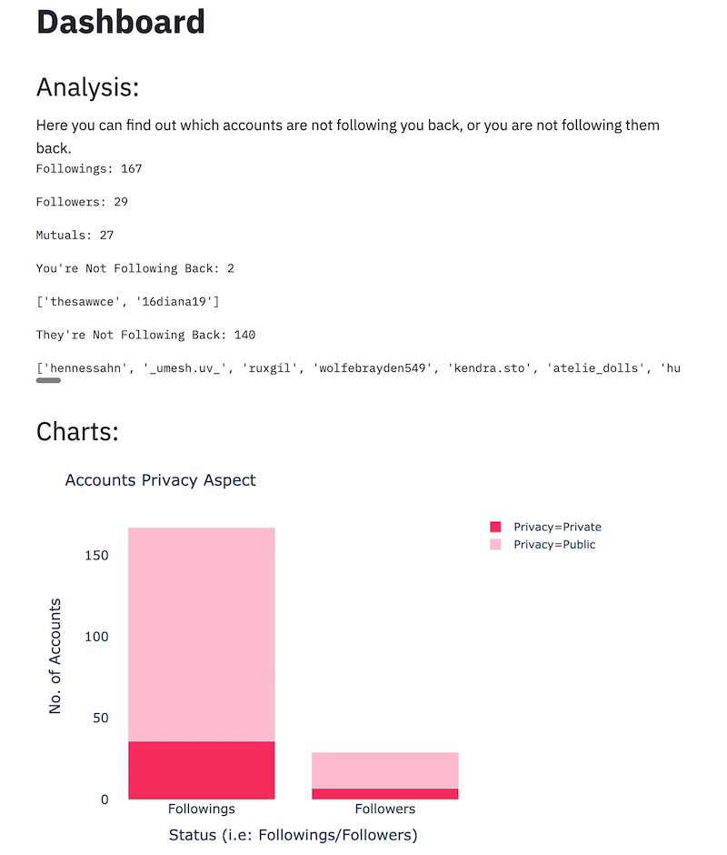

# Insta-Check
## Instagram Analysis Tool

---



---

### Features:

Insta-Check is an Instagram Analysis tool which has the following features:

- Showing accounts that are not following back
- Showing accounts that you don't follow back

Moreover, the following features are visualised in barcharts:

- Private to Public accounts ratio for Followers and Followings
- Verified to Non-Verified accounts ratio for Followers and Followings

---

### To Run

```git clone https://github.com/rezan21/Insta-Check.git```

```cd Insta-Check```

```pip install -r requirements.txt```

```streamlit run app.py```

---

API used in this app is provided by [Instagram-Private-API](https://github.com/ping/instagram_private_api)
